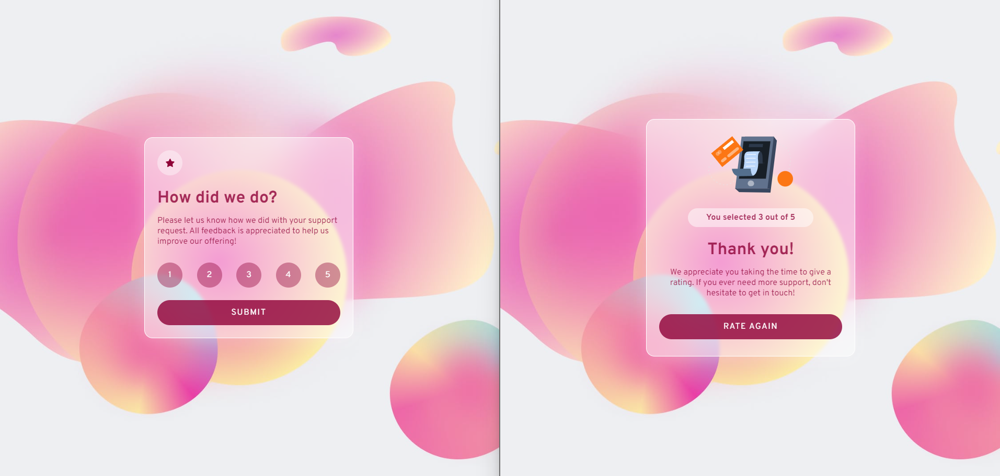

# Frontend Mentor - Interactive rating component solution

This is a solution to the [Interactive rating component challenge on Frontend Mentor](https://www.frontendmentor.io/challenges/interactive-rating-component-koxpeBUmI). Frontend Mentor challenges help you improve your coding skills by building realistic projects. 

## Table of contents

- [Overview](#overview)
  - [The challenge](#the-challenge)
  - [Screenshot](#screenshot)
  - [Links](#links)
- [My process](#my-process)
  - [Built with](#built-with)
  - [What I learned](#what-i-learned)
- [Author](#author)
- [Acknowledgments](#acknowledgments)


## Overview

### The challenge

Users should be able to:

- View the optimal layout for the app depending on their device's screen size
- See hover states for all interactive elements on the page
- Select and submit a number rating
- See the "Thank you" card state after submitting a rating
- Click on 'Rate Again' to return to the ratings side

### Screenshot

- Main: 


### Links

- Solution URL: [Add solution URL here](https://your-solution-url.com)
- Live Site URL: [Add live site URL here](https://your-live-site-url.com)

## My process

### Built with

- Semantic HTML5 markup
- CSS custom properties
- Flexbox
- CSS Grid
- Mobile-first workflow
- [React](https://reactjs.org/) - JS library

### What I learned

During the process, I had the issue where I have to click twice on the rating button for it to be in focus or selected mode. I learnt that it is because of how the useState hook works in React.

In my earlier iterations of the code, I used the 'setItems' function to update the items state variable when a rating button is clicked. However, the state update is asynchronous, which means that the updated value of items won't be immediately available after calling 'setItems'.

So, when I check for isRatingSelected inside the ToRate component to enable or disable the submit button, it may not have the updated value of items on the first click. That's why I need to click twice for it to be in focus or selected mode.

To fix this issue, I use the previous state value provided by the setItems function instead of relying on the current state value. This ensures that there is always an up-to-date value of items.

old
```
<div className='rating-btn-grp'>
  {[1, 2, 3, 4, 5].map((num) => (
    <button 
      key={num} 
      onClick={() => setItems(num)}
    >{num}
    </button>))}
</div>
```

New 
```
<div className='rating-btn-grp'>
  {[1, 2, 3, 4, 5].map((num) => (
    <button
      key={num}
      onClick={() => setItems(prevItems => prevItems !== num ? num : "")} // Use previous state value
      className={items === num ? 'selected' : ''} // Add a CSS class to apply selected style
    >{num}
    </button>
  ))}
</div>
```

## Author

- Frontend Mentor - [@Jo-cloud85](https://www.frontendmentor.io/profile/Jo-cloud85)


## Acknowledgments

- Background-image: 
  
  
  
